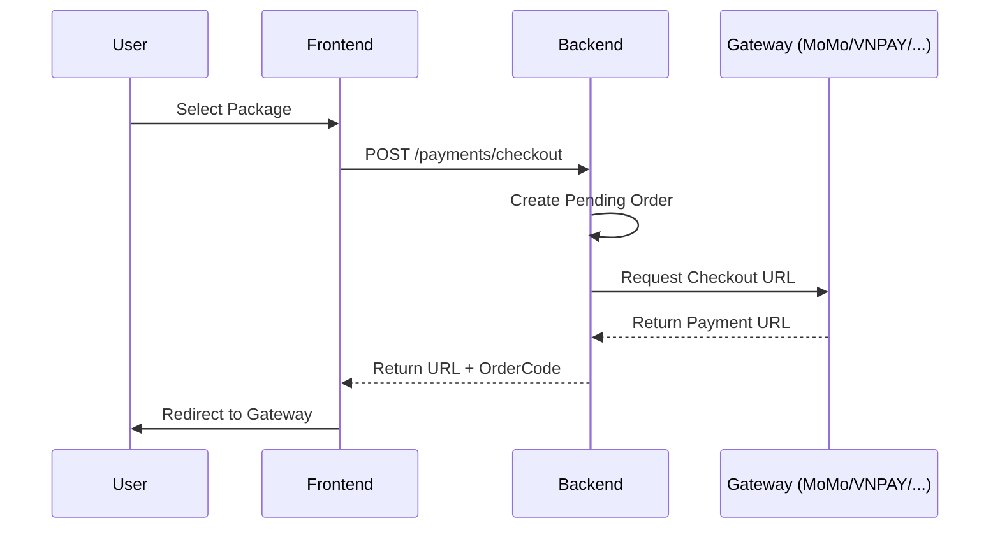

# 💳 Payment Service Architecture

This service handles multi-provider payment integrations for credit top-ups.

## 🚀 Supported Providers
- **VNPAY**: Standard redirect flow.
- **MoMo**: Integrated via API with HMAC-SHA256 signature.
- **ZaloPay**: Uses `app_trans_id` with a specific date format `YYMMDD_orderCode`.
- **9Pay**: Custom return URL handling with base64 data and signature.

## 🛠️ Key Workflows

### 1. Checkout Flow

### 2. Callback / IPN Handling
- **Return URL**: Handles immediate user redirection back to the app.
- **IPN (Instant Payment Notification)**: Server-to-server callback for final status confirmation.
- **Credits Update**: Credits are only added when status is `paid` and `verified` is true.

## 📝 Technical Gotchas
- **ZaloPay MAC Calculation**: Order of fields in the pipe-separated string is critical: `appId|appTransId|appUser|amount|appTime|embedData|item`.
- **9Pay Signature**: Requires decoding base64 data first, then verifying the signature against the raw payload.
- **Precision**: Amount must be in VND (integer).
