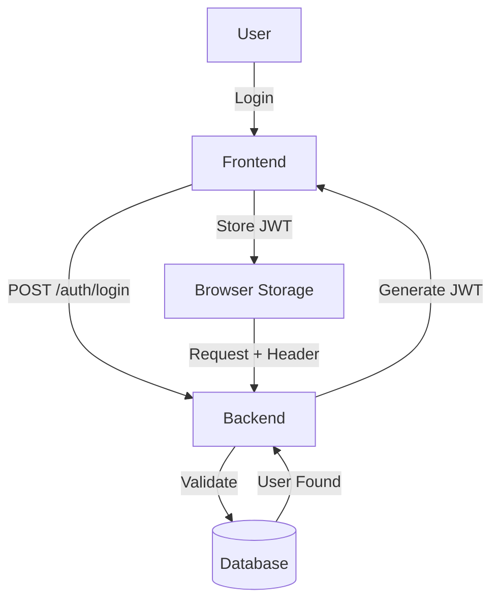

# 🔐 Authentication Architecture

The system uses JWT-based authentication with social provider support.

## 🔄 Auth Flow

## 🎨 UI/UX Features
- **Split Screen**: 1024px+ shows a visual panel with animated mesh gradients.
- **Form States**: Loading, Error, Success feedback integrated with Shadcn UI.
- **Social Login**: Google, Facebook buttons with custom styling in `auth-layout.css`.

## 🛠️ Code Reference
- **Controller**: `auth.controller.ts`
- **Styles**: `auth-layout.css` (uses CSS @layer architecture)
- **Guard**: `jwt-auth.guard.ts`
