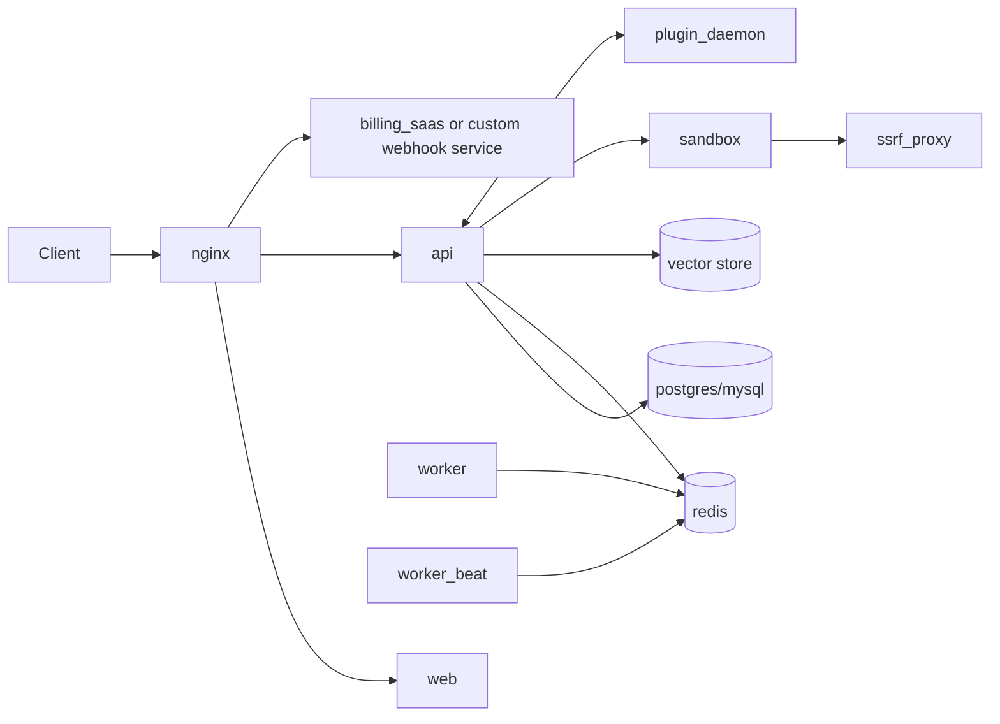

# Docker Architecture

This repository uses a multi-service Docker layout centered on the application split already implemented in the backend.

## Layer Model

### Core application

- `api`: main backend gateway/runtime
- `worker`: background queue processor
- `worker_beat`: scheduled task runner
- `web`: console frontend
- `landing`: public landing page
- `nginx`: public reverse proxy entrypoint

### Required infrastructure

- `postgres` or `mysql` selected by environment/profile
- `redis` for cache and queue broker
- `sandbox` plus `ssrf_proxy` for safe tool execution
- `plugin_daemon` for plugin runtime

### Optional infrastructure

Vector and search backends are selected by profile/environment:

- `weaviate`
- `qdrant`
- `milvus`
- `pgvector`
- `opensearch`
- `elasticsearch`
- `chroma`
- `matrixone`

### SSL / TLS

- `nginx` handles HTTPS from environment configuration
- `certbot` is a separate profile for certificate issuance and renewal

### Persisted data

- Local data stays under `docker/volumes/*`
- Additional named volumes can be added for service-specific data sets

## Repository Source Files

When porting this layout to another repo, these files are the main source of truth:

- `docker/docker-compose.yaml`
- `docker/docker-compose-template.yaml`
- `docker/.env.example`
- `docker/generate_docker_compose`
- `docker/docker-compose.middleware.yaml`
- `docker/middleware.env.example`
- `docker/nginx/*`
- `docker/ssrf_proxy/*`
- `docker/build-web.ps1`
- `docker/build-web.cmd`
- `docker/verify-stack.cmd`
- `docker/.dockerignore`

## Runtime Flow

## Current Repo Mapping

This repository does not yet use the full Dify-style `docker/` template layout, but the active compose stack maps cleanly:

- `api` -> gateway/backend runtime
- `worker` -> queue processor
- `billing-service` -> money and credits boundary
- `generation-service` -> task execution and credit reservation boundary
- `frontend` -> web console
- `postgres`, `redis`, `minio` -> core infrastructure

## Operational Rules

- Put all configuration through environment variables.
- Pick database/vector implementations through profile or env switches.
- Keep reverse-proxy routing centralized.
- Split middleware-only compose from full app compose when a repo needs faster local development.
- Keep custom billing or plugin blocks isolated from the generic app runtime.
